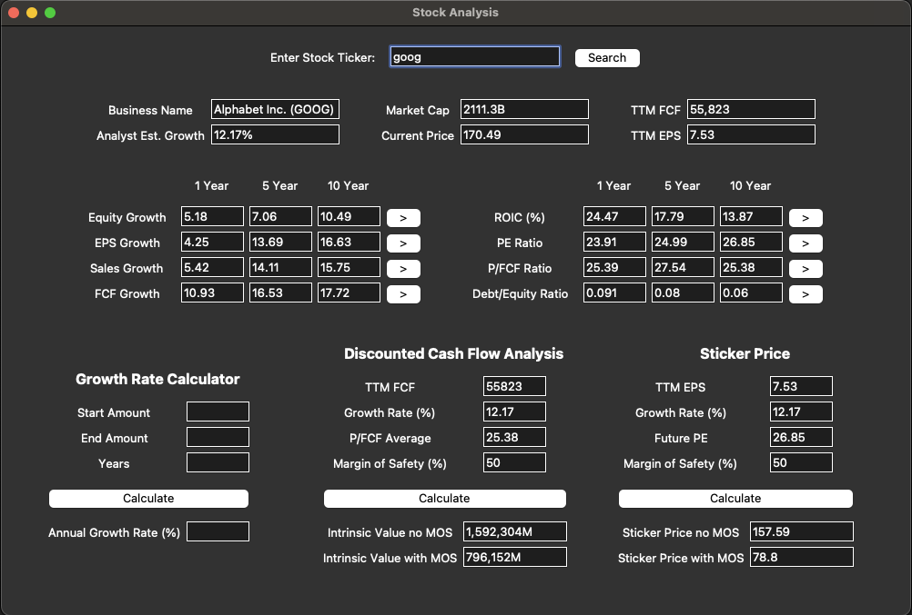
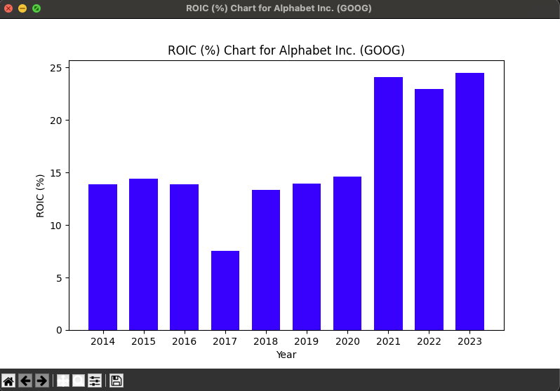

# Stock Analysis Tool
Inspired from 'Rule #1 Investing' by Phil Town and 'The Little Book That Still Beats The Market' by Joel Greenblatt. A GUI application that scrapes financial data for a given business and calculates one, five, and ten year growth rates for equity, earnings per share, gross profit, and free cash flow. Historic data for return on invested capital, price earnings ratio, price/free cash flow ratio, and the debt/equity ratio is also scraped. 

Includes a DCFA (Discounted Cash Flow Analysis) and a Sticker Price calculator, which uses scraped data as inputs to calculate a fair price for a business with a Margin of Safety included. User can click button next to each set of historic data to view it as a bar graph.

## Technology Used
- Python
- Tkinter
- matplotlib

## Images

